# Frontend Mentor - Interactive comments section solution

This is a solution to the [Interactive comments section challenge on Frontend Mentor](https://www.frontendmentor.io/challenges/interactive-comments-section-iG1RugEG9). Frontend Mentor challenges help you improve your coding skills by building realistic projects.

## Table of contents

- [Overview](#overview)
  - [The challenge](#the-challenge)
  - [Screenshot](#screenshot)
  - [Links](#links)
- [My process](#my-process)
  - [Built with](#built-with)
  - [What I learned](#what-i-learned)
  - [Continued development](#continued-development)
  - [Useful resources](#useful-resources)
- [Author](#author)

## Overview

### The challenge

Users should be able to:

- View the optimal layout for the app depending on their device's screen size
- See hover states for all interactive elements on the page
- Create, Read, Update, and Delete comments and replies
- Upvote and downvote comments
- **Bonus**: If you're building a purely front-end project, use `localStorage` to save the current state in the browser that persists when the browser is refreshed.
- **Bonus**: Instead of using the `createdAt` strings from the `data.json` file, try using timestamps and dynamically track the time since the comment or reply was posted.

### Screenshot

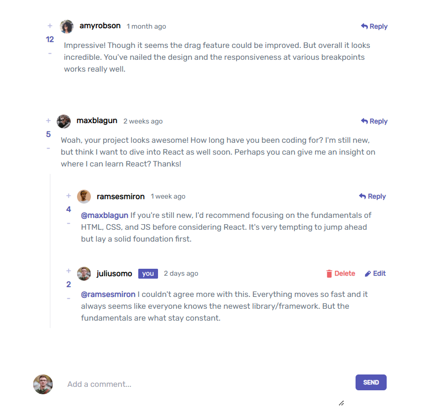
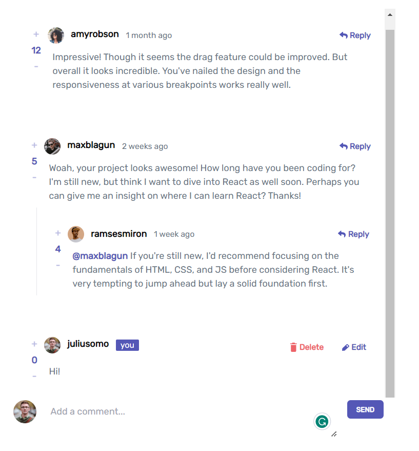
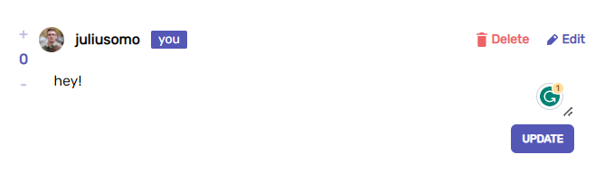
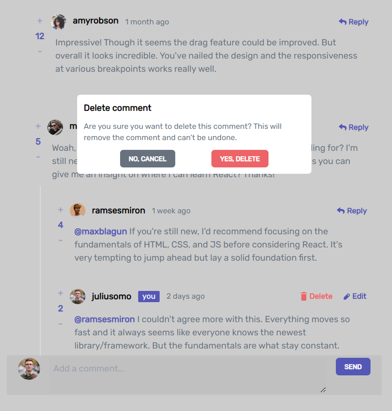
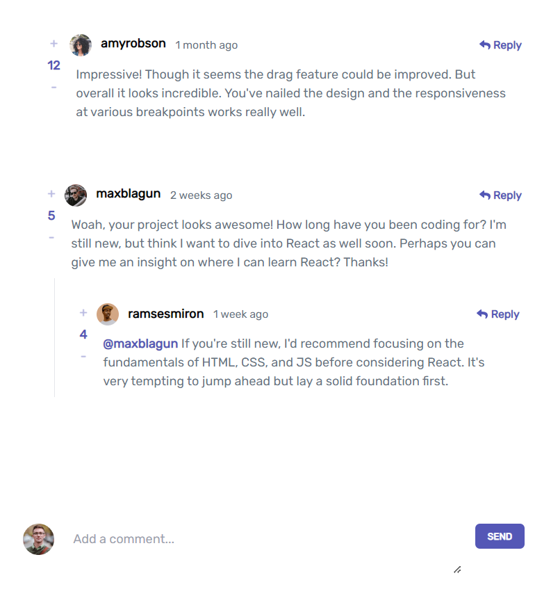
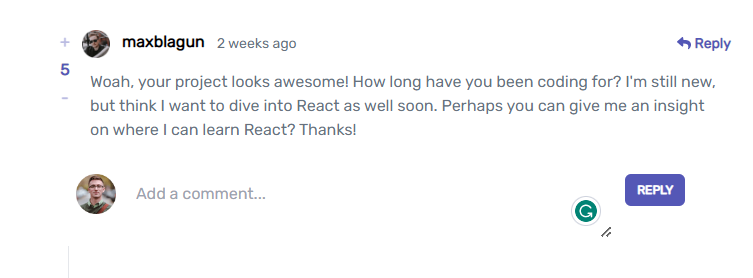
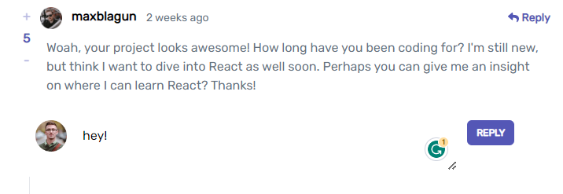
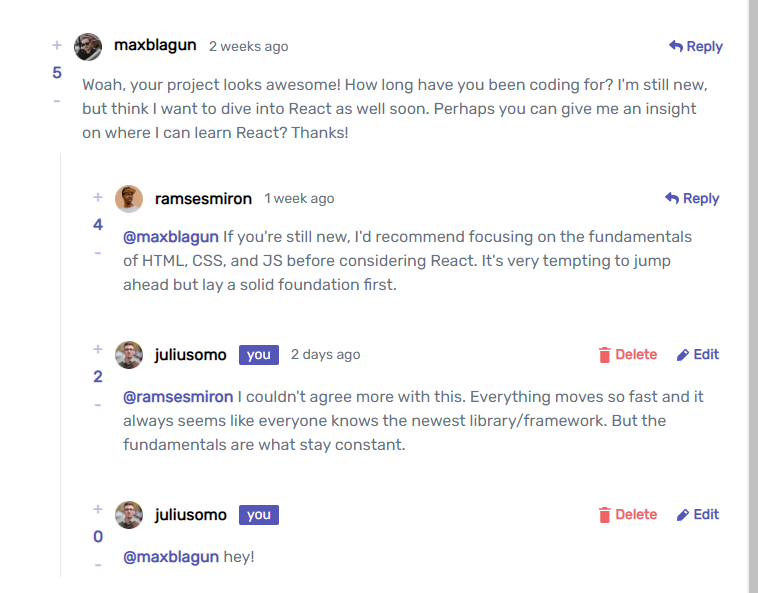
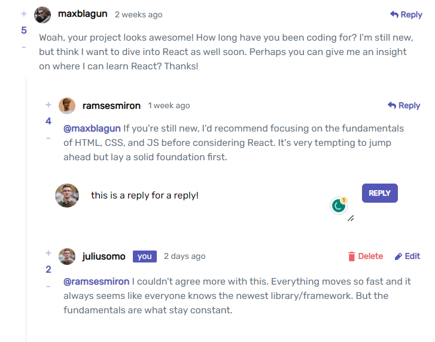
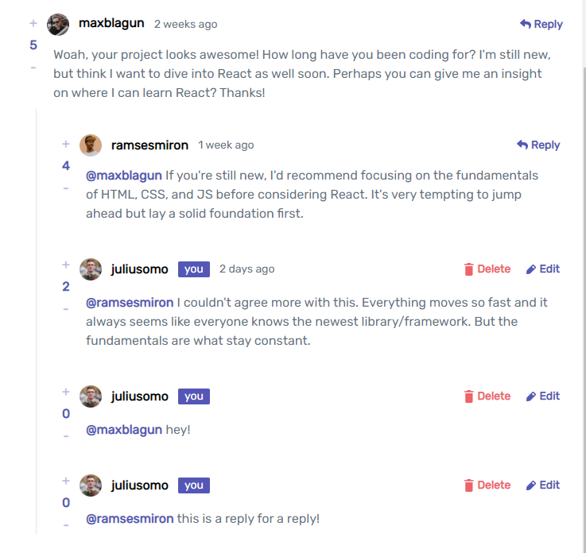
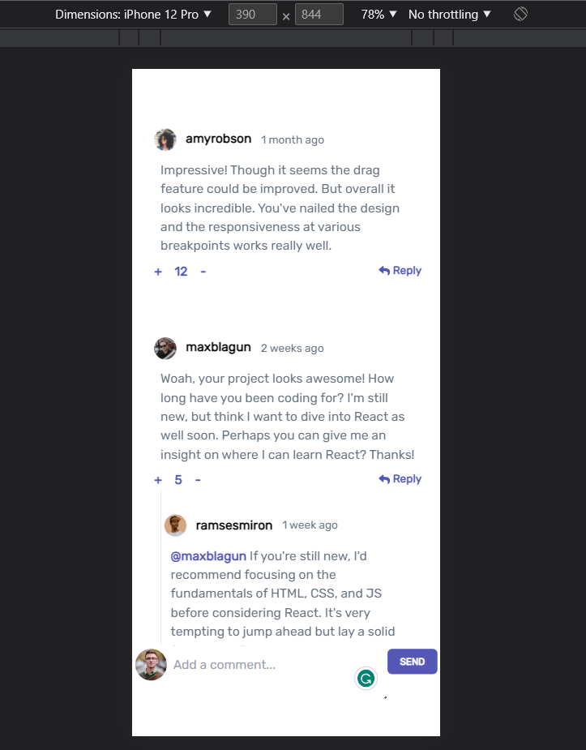
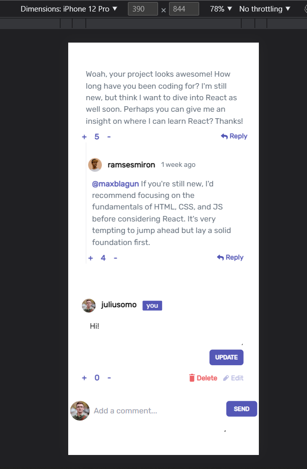
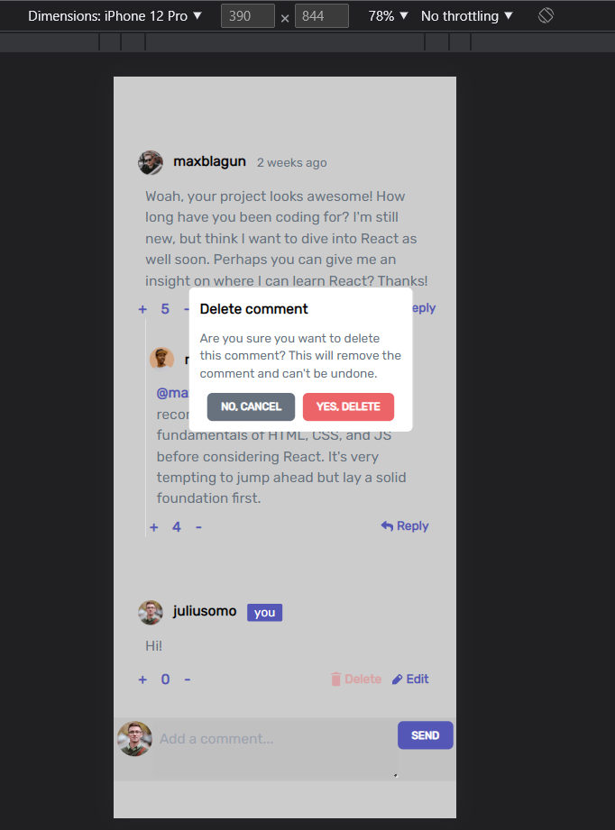

### Links

- Solution URL: [Github_Link](https://github.com/nishanthbs1998/interactive_comments)
- Live Site URL: [Live_Site](https://startling-trifle-11d42a.netlify.app/)

## My process

1. outlined the structure, components that would be required and the overall code design.
2. Started implementing one feature at a time.
3. Focused on functionality first, once that was satisfactory, then focused on the design and aesthetics.

### Built with

- TailwindCSS
- Flexbox
- Mobile-first workflow
- [React](https://reactjs.org/) - JS library

### What I learned

1. Using Google fonts in TailwindCSS

```Inside tailwind config
module.exports = {
  content: ["./src/**/*.{js,jsx,ts,tsx}",],
  theme: {
    extend: {
      fontFamily:{
        Rubik:['Rubik', 'sans-serif']
      }
    },
  },
  plugins: [],
}

```

### Continued development

1. Writing more organized and cleaner code.

### Useful resources

- [CSS](https://developer.mozilla.org/en-US/docs/Web/CSS)
- [JS](https://developer.mozilla.org/en-US/docs/Web/JavaScript)
- [TailwindCSS](https://tailwindcss.com/)
- [React](https://react.dev/learn)

## Author

- Website - [Nishanth BS](https://nishanthbs1998.github.io/portfolio/)
- Github - [nishanthbs1998](https://github.com/nishanthbs1998)
- LinkedIn - [nishanthbs](https://www.linkedin.com/in/nishanth-b-s-2a0570170/)
